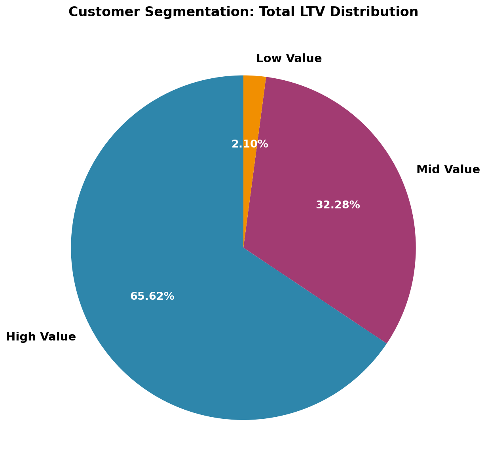
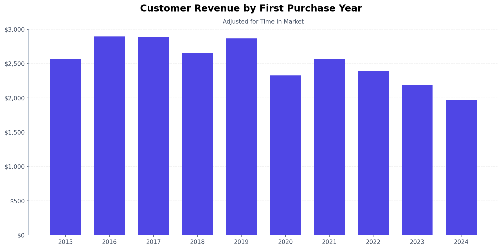
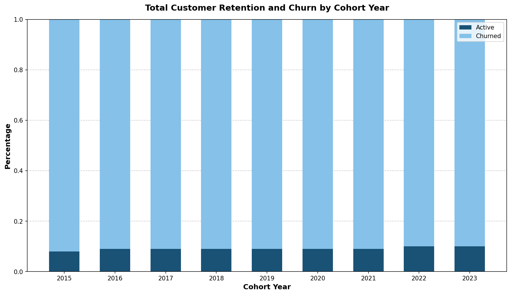

# Intermediate SQL - Sales Analysis

## Overview
Analysis of customer behavior, retention, and lifetime value for an e-commerce company to improve customer retention and maximize revenue.

## Business Questions
1. **Customer Segmentation:** Who are our most valuable customers?
2. **Cohort Analysis:** How do different customer groups generate revenue?
3. **Retention Analysis:** Which customers haven't purchased recently?

## Analysis 

### 1. Customer Segmentation

- Categorized customers based on total lifetime value (LTV)
- Assigned customers to High, Mid, and Low-value segments
- Calculated key metrics: total revenue

Query: [1_customer_segmentation.sql](/1_customer_segmentation.sql)

**Visualizations:**

                                      

**Key Findings:**
- High-value segment (25% of customers) drives almost 66% of revenue ($135.4M)
- Mid-value segment (50% of customers) generates over 32% of revenue ($66.6M)
- Low-value segment (25% of customers) accounts for 2% of revenue ($4.3M)

**Business Insights**
- High-Value (66% revenue): Offer premium membership program to 12372 VIP customers. Provide early access to new products.
- Mid-Value (32% revenue): 
Target with 'next best product' recommendations based on high-value patterns.
- Low-Value (2% Revenue): Design re-engagement campaigns for 12372 customers to increase purchase frequency.
### 2. Cohort Analysis

- Tracked revenue and customer count per cohorts
- Cohorts were grouped by year of first purchase
- Analyzed customer retention at a cohort level

Query: [2_cohort_analysis.sql](/2_cohort_analysis.sql)

**Visualizations:**

Customer Revenue by Cohort (Adjusted for time in market) - First Purchase Date

**Key Findings:**
- Revenue per customer shows an alarming decreasing trend over time
- 2022-2024 cohorts are consistently performing worse than earlier cohorts
- Although net revenue is increasing, this is likely due to a larger customer base, which is not reflective of customer value

**Business Insights**
- Value extracted from customers is decreasing over time and needs further investigation
- In 2023, we saw a significant decrease in number of customers acquired, which is concerning.
- The company is facing a potential revenue decline due to both lowering LTV and decreasing customer acquisition.

### 3. Customer Retention

- Identified customers at risk of churning
- Analyzed last purchase patterns
- Calculated customer-specific metrics

Query: [3_retention_analysis.sql](/3_retention_analysis.sql)

**Visualizations:**

**Key Findings:**
- Cohort churn stabilizes at roughly 90% after 2-3 years, indicating a possible long-term retention pattern.
- Retention rates stay within 8-10% among all cohorts, suggesting retention issues are systemic rather than specific to certain years.
- Most recent cohorts (2022-2023) show similar purchase patterns suggesting future cohorts will likely follow the same patterns unless intervention is staged.

**Business Insights**
- Strengthen early engagement strategies to target the first 1-2 years with onboarding incentives, loyalty rewards, and personalized offers to improve long-term retention,
- Re-engage high-value churned customers by focusing on targeted win-back campaigns rather than broad retention efforts.

## Strategic Recommendations
1. **Customer Value Optimization** (Customer Segmentation)
    - Launch VIP program for 12,372 high-value customers (66% revenue)
    - Create personalized upgrade paths for mid-value segment
    - Design price-sensitive promotions for low-value segment to increase purchase frequency
2. **Cohort Performance Strategy** (Customer Revenue by Cohort)
    - Target 2022-2024 cohorts with personalized re-engagement offers
    - Implement loyalty/subscription programs to stabilize revenue fluctuations
3. **Retention & Churn Prevention** (Customer Retention)
    - Strengthen first 1-2 year engagement with onboarding incentives and loyalty rewards
    - Focus on targeted win-back campaigns for high-value churned customers

## Technical Details
- **Database:** PostgreSQL
- **Analysis Tools:** PostgreSQL, DBeaver, PGadmin
- **Visualization:** Claude
